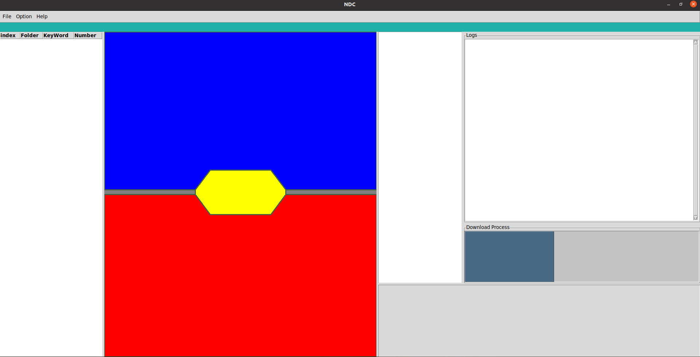

# Python great tkinter gui
# Great tkinter gui

This is a GUI project in python and tkinter that can be used for the front-end part in many python desktop application. This project is entirely has been built with the famous python tkinter project and it contains the usage of many  tkinter elements. This Gui is also responsive to the size of screen in the good manner. the whole of the project has been developed with the Object Oriented programming (OOP) principle.
- Python  tkinter gui
- Object Oriented programming 
# Screenshot

## Installation
- it doesn't need any kind of installation.

## Usage
- run file Main.py

## Maintainer
* Hossein Biniazian, github: [iamhosseinbiniazian](https://github.com/iamhosseinbiniazian)
